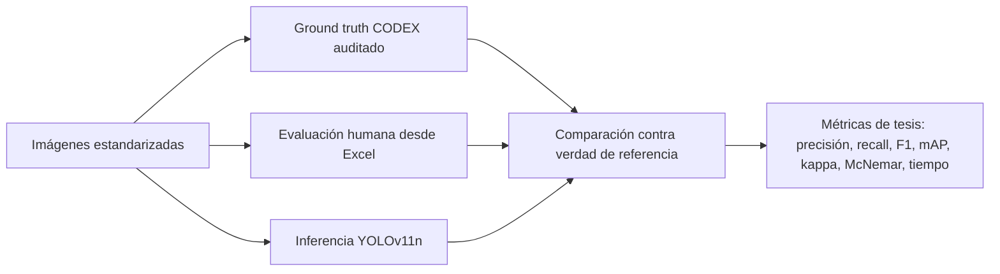

# Paquete de directivas para generar la herramienta de validación de tesis

## Proyecto

Herramienta para validar una tesis de visión artificial basada en YOLOv11n aplicada a la clasificación de hongos comestibles desecados según CODEX STAN 39-1981 en la Cooperativa Agraria Sumaq Agro Ecologico Cusco - Casaec.

## Idea central

La herramienta NO debe tratar la evaluación humana como verdad absoluta ni tratar la salida de la IA como verdad absoluta.

La lógica correcta es:

## Módulos del paquete

0. `00_CONTEXTO_TESIS_PRESERVADO.md`  
   Conserva el título, pregunta, objetivos, hipótesis, variables, instrumentos y límites de la tesis para que el sistema no se vuelva genérico.
1. `01_DIRECTIVA_MAESTRA.md`  
   Instrucción general para Codex/agente.

2. `02_LOGICA_INVESTIGACION_IRREFUTABLE.md`  
   Reglas metodológicas para que la validación sea defendible.

3. `03_CODEX_CODEBOOK_YOLO.md`  
   Clases, criterios de anotación y límites del estándar CODEX.

4. `04_MODULO_ETIQUETADO_AUDITORIA.md`  
   Interfaz para ver etiquetas, corregirlas, auditarlas y exportar dataset YOLO limpio.

5. `05_MODULO_IMPORTACION_EXCEL_HUMANO.md`  
   Estructura del Excel de trabajadores y reglas de validación.

6. `06_MODULO_INFERENCIA_IA.md`  
   Interfaz para procesar imágenes con YOLOv11n, guardar detecciones y tiempos.

7. `07_MODULO_GROUND_TRUTH_CODEX.md`  
   Cómo construir la verdad de referencia basada en CODEX, consenso y auditoría.

8. `08_METRICAS_ESTADISTICA_VALIDACION.md`  
   Métricas, fórmulas, tablas y salidas necesarias para tesis.

9. `09_BASE_DATOS_API_BACKEND.md`  
   Modelo de base de datos y endpoints sugeridos.

10. `10_UI_UX_FLUJOS.md`  
    Pantallas y navegación de la herramienta.

11. `11_PROMPT_FINAL_PARA_CODEX.md`  
    Prompt listo para pegar en Codex u otro modelo programador.

12. `12_QA_CRITERIOS_ACEPTACION.md`  
    Pruebas mínimas para aceptar que la herramienta funciona.

13. `13_MAPEO_TESIS_A_HERRAMIENTA.md`  
    Mapea cada parte de la tesis a módulos, tablas, métricas y reportes de la herramienta.

## Orden de construcción recomendado

1. Implementar base de datos y carga de imágenes.
2. Implementar módulo de etiquetado/auditoría.
3. Implementar importador de Excel humano.
4. Implementar módulo de ground truth CODEX.
5. Implementar inferencia YOLOv11n.
6. Implementar comparación humano vs IA.
7. Implementar métricas y exportación de reportes.
8. Ejecutar QA metodológico para evitar sesgos.
