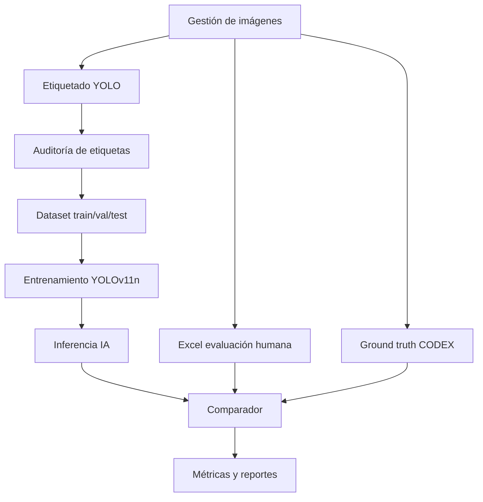

# Directiva maestra de implementación

## Objetivo del sistema

Construir una herramienta web/local para validar una tesis de visión artificial con YOLOv11n aplicada a hongos comestibles desecados según CODEX STAN 39-1981.

La herramienta debe permitir:

1. Ver, corregir y auditar etiquetas YOLO.
2. Importar evaluaciones humanas desde Excel.
3. Procesar imágenes con YOLOv11n.
4. Registrar una verdad de referencia basada en CODEX.
5. Comparar humano vs IA sobre las mismas imágenes.
6. Calcular métricas técnicas, estadísticas y de eficiencia.
7. Exportar evidencias para tesis.

## Principio metodológico central

La comparación correcta no es:

```text
Humano vs IA, donde humano decide la verdad.
```

La comparación correcta es:

```text
Ground truth CODEX auditado
    vs evaluación humana
    vs inferencia YOLOv11n
```

El Excel de trabajadores representa la clasificación manual. No representa automáticamente la verdad.

La verdad de referencia debe venir de:

- etiquetas auditadas,
- revisión experta,
- consenso entre expertos,
- o una decisión documentada bajo criterios CODEX operacionalizados.

## Alcance real del sistema

La herramienta solo valida defectos e impurezas visibles en imágenes RGB.

No debe afirmar que mide directamente:

- humedad,
- impureza mineral por residuo insoluble en ácido,
- contaminación microbiológica,
- calidad fisicoquímica,
- masa real `m/m` sin medición complementaria.

Cuando CODEX usa masa o laboratorio, la herramienta debe tratarlo como:

```text
proxy visual documentado
```

## Resultado final esperado

El sistema debe poder producir estos reportes:

1. Reporte de calidad del dataset.
2. Reporte de auditoría de etiquetas.
3. Dataset YOLO limpio.
4. Bitácora de entrenamiento.
5. Reporte de inferencia.
6. Reporte de evaluación humana.
7. Reporte de ground truth.
8. Reporte comparativo humano vs IA.
9. Matrices de confusión.
10. Kappa.
11. McNemar.
12. Comparación de tiempos.
13. Exportación Excel/PDF para anexos de tesis.

## Arquitectura funcional



## Roles

### Tesista / administrador

- Carga imágenes.
- Define lotes.
- Revisa dataset.
- Ejecuta inferencia.
- Genera reportes.

### Anotador

- Etiqueta imágenes.
- Corrige cajas.
- Marca observaciones.

### Auditor / experto

- Aprueba etiquetas.
- Define ground truth.
- Resuelve casos frontera.

### Trabajador evaluador

- Evalúa imágenes en Excel o formulario.
- No debe ver resultados de IA.
- No debe ver ground truth.

## Reglas de independencia

Para que la investigación sea defendible:

1. El trabajador no debe ver la predicción de IA antes de evaluar.
2. El modelo no debe entrenarse con el conjunto de prueba.
3. El ground truth no debe construirse usando la predicción del modelo como criterio principal.
4. El conjunto test debe congelarse antes de la inferencia final.
5. La evaluación humana y la IA deben usar las mismas imágenes.
6. Todo cambio de etiqueta debe quedar auditado.
