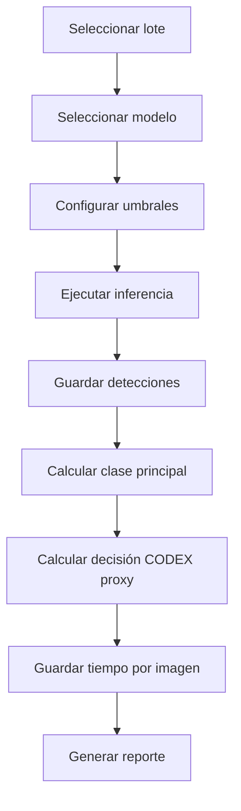

# Módulo de inferencia IA con YOLOv11n

## Objetivo

Procesar imágenes con el modelo YOLOv11n entrenado, guardar detecciones, tiempos y decisiones finales para compararlas contra ground truth y humanos.

## Entradas

```text
imagenes
modelo best.pt
configuración de inferencia
umbral de confianza
umbral IoU
versión de Ultralytics
```

## Parámetros obligatorios

| Parámetro | Ejemplo |
|---|---|
| modelo_version | yolov11n_codex_v1 |
| model_path | models/yolov11n_codex_v1/best.pt |
| confidence_threshold | 0.25 |
| iou_threshold | 0.50 |
| image_size | 640 |
| device | cpu/cuda |
| ultralytics_version | registrar automáticamente |

## Flujo



## Resultado por detección

```json
{
  "codigo_imagen": "LOTE_001_IMG_0001",
  "modelo_version": "yolov11n_codex_v1",
  "class_id": 4,
  "class_name": "larvas",
  "confidence": 0.87,
  "x1": 120,
  "y1": 80,
  "x2": 220,
  "y2": 180,
  "bbox_area_px": 10000,
  "image_width": 1280,
  "image_height": 720
}
```

## Resultado por imagen

```json
{
  "codigo_imagen": "LOTE_001_IMG_0001",
  "modelo_version": "yolov11n_codex_v1",
  "detecciones_total": 3,
  "clases_detectadas": ["larvas", "carbonizado"],
  "clase_principal_modelo": "larvas",
  "decision_modelo": "observado",
  "tiempo_inferencia_ms": 41,
  "fecha_inferencia": "2026-05-07T10:15:00"
}
```

## Clase principal del modelo

Regla sugerida:

```text
Si no hay detecciones:
    clase_principal_modelo = normal

Si hay detecciones:
    clase_principal_modelo = clase de mayor prioridad metodológica

Si hay empate:
    usar mayor confianza promedio

Si persiste empate:
    marcar como observado
```

## Prioridad metodológica sugerida

```text
impureza_mineral
impureza_vegetal
larvas
carbonizado
danado
aplastado
pie_desprendido
normal
```

## Decisión final del modelo

La decisión no debe ser solo la clase. Debe calcularse por regla.

Ejemplo:

```text
normal -> apto
carbonizado -> observado/no_apto según umbral proxy
larvas leve -> observado
larvas severo -> no_apto
impureza_mineral visible -> observado/no_apto según protocolo
impureza_vegetal visible -> observado/no_apto según protocolo
```

## Versionamiento del modelo

Guardar:

```text
modelo_version
model_hash_sha256
fecha_entrenamiento
dataset_version
train_count
val_count
test_count
epochs
imgsz
batch
optimizer
metrics_val
```

## Bitácora de inferencia

Cada corrida debe registrar:

```text
run_id
modelo_version
usuario
fecha_inicio
fecha_fin
total_imagenes
imagenes_procesadas
imagenes_error
tiempo_total_ms
tiempo_promedio_ms
confidence_threshold
iou_threshold
device
```

## Visualización

La interfaz debe mostrar:

- imagen original,
- imagen con cajas,
- clase,
- confianza,
- tiempo,
- decisión,
- botón para enviar a revisión si el resultado parece dudoso.

## Criterios de aceptación

El módulo está completo si:

1. Ejecuta YOLOv11n.
2. Guarda detecciones.
3. Guarda tiempo por imagen.
4. Calcula clase principal.
5. Calcula decisión modelo.
6. Versiona modelo y configuración.
7. Permite reproducir una corrida.
8. Exporta resultados a CSV/JSON.
