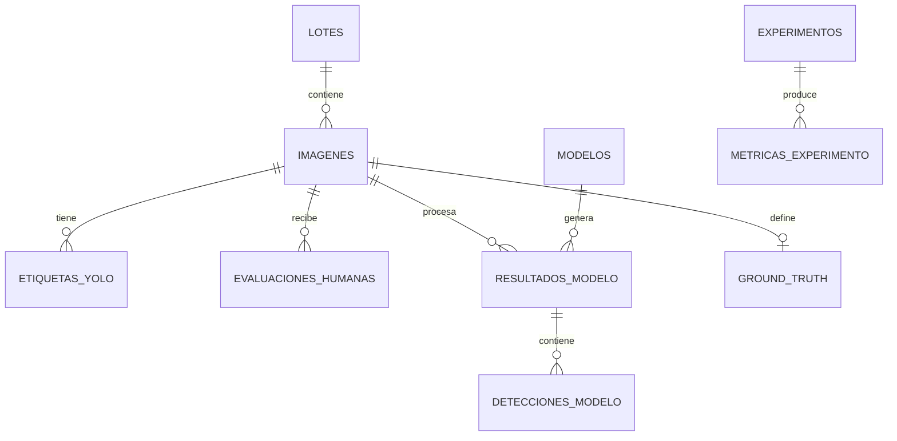

# Base de datos y API backend

## Objetivo

Definir una base de datos limpia para soportar etiquetado, auditoría, evaluación humana, inferencia IA, ground truth y métricas.

## Entidades principales



## Tablas sugeridas

### lotes

```sql
CREATE TABLE lotes (
  id BIGINT PRIMARY KEY AUTO_INCREMENT,
  codigo_lote VARCHAR(100) NOT NULL UNIQUE,
  origen VARCHAR(100),
  fecha_captura DATE,
  descripcion TEXT,
  created_at DATETIME NOT NULL DEFAULT CURRENT_TIMESTAMP
);
```

### imagenes

```sql
CREATE TABLE imagenes (
  id BIGINT PRIMARY KEY AUTO_INCREMENT,
  lote_id BIGINT,
  codigo_imagen VARCHAR(200) NOT NULL UNIQUE,
  ruta_archivo TEXT NOT NULL,
  width INT,
  height INT,
  tipo_presentacion VARCHAR(50),
  sesion_captura VARCHAR(100),
  split_dataset VARCHAR(20),
  estado_auditoria VARCHAR(50) NOT NULL DEFAULT 'pendiente',
  hash_archivo VARCHAR(128),
  created_at DATETIME NOT NULL DEFAULT CURRENT_TIMESTAMP
);
```

### etiquetas_yolo

```sql
CREATE TABLE etiquetas_yolo (
  id BIGINT PRIMARY KEY AUTO_INCREMENT,
  imagen_id BIGINT NOT NULL,
  class_id INT NOT NULL,
  class_name VARCHAR(100) NOT NULL,
  x_center DECIMAL(12,8) NOT NULL,
  y_center DECIMAL(12,8) NOT NULL,
  width DECIMAL(12,8) NOT NULL,
  height DECIMAL(12,8) NOT NULL,
  fuente VARCHAR(50) NOT NULL DEFAULT 'manual',
  anotador VARCHAR(100),
  estado VARCHAR(50) NOT NULL DEFAULT 'pendiente',
  observacion TEXT,
  created_at DATETIME NOT NULL DEFAULT CURRENT_TIMESTAMP
);
```

### auditoria_etiquetas

```sql
CREATE TABLE auditoria_etiquetas (
  id BIGINT PRIMARY KEY AUTO_INCREMENT,
  imagen_id BIGINT NOT NULL,
  etiqueta_id BIGINT NULL,
  usuario VARCHAR(100) NOT NULL,
  accion VARCHAR(100) NOT NULL,
  valor_anterior JSON NULL,
  valor_nuevo JSON NULL,
  motivo TEXT,
  created_at DATETIME NOT NULL DEFAULT CURRENT_TIMESTAMP
);
```

### evaluaciones_humanas

```sql
CREATE TABLE evaluaciones_humanas (
  id BIGINT PRIMARY KEY AUTO_INCREMENT,
  imagen_id BIGINT NOT NULL,
  evaluador VARCHAR(100) NOT NULL,
  defecto_danado BOOLEAN,
  defecto_carbonizado BOOLEAN,
  defecto_aplastado BOOLEAN,
  defecto_larvas VARCHAR(20),
  impureza_vegetal BOOLEAN,
  impureza_mineral BOOLEAN,
  pie_desprendido_cantidad INT,
  etiqueta_final_humana VARCHAR(100) NOT NULL,
  decision_humana VARCHAR(50) NOT NULL,
  tiempo_segundos DECIMAL(12,4) NOT NULL,
  observaciones TEXT,
  created_at DATETIME NOT NULL DEFAULT CURRENT_TIMESTAMP,
  UNIQUE (imagen_id, evaluador)
);
```

### modelos

```sql
CREATE TABLE modelos (
  id BIGINT PRIMARY KEY AUTO_INCREMENT,
  modelo_version VARCHAR(100) NOT NULL UNIQUE,
  model_path TEXT NOT NULL,
  model_hash_sha256 VARCHAR(128),
  dataset_version VARCHAR(100),
  epochs INT,
  imgsz INT,
  batch_size INT,
  optimizer VARCHAR(100),
  ultralytics_version VARCHAR(100),
  fecha_entrenamiento DATETIME,
  metricas_validacion JSON,
  created_at DATETIME NOT NULL DEFAULT CURRENT_TIMESTAMP
);
```

### resultados_modelo

```sql
CREATE TABLE resultados_modelo (
  id BIGINT PRIMARY KEY AUTO_INCREMENT,
  imagen_id BIGINT NOT NULL,
  modelo_id BIGINT NOT NULL,
  run_id VARCHAR(100) NOT NULL,
  clase_principal_modelo VARCHAR(100),
  decision_modelo VARCHAR(50),
  detecciones_total INT,
  tiempo_inferencia_ms DECIMAL(12,4),
  confidence_threshold DECIMAL(5,4),
  iou_threshold DECIMAL(5,4),
  created_at DATETIME NOT NULL DEFAULT CURRENT_TIMESTAMP
);
```

### detecciones_modelo

```sql
CREATE TABLE detecciones_modelo (
  id BIGINT PRIMARY KEY AUTO_INCREMENT,
  resultado_modelo_id BIGINT NOT NULL,
  class_id INT NOT NULL,
  class_name VARCHAR(100) NOT NULL,
  confidence DECIMAL(6,5) NOT NULL,
  x1 DECIMAL(12,4) NOT NULL,
  y1 DECIMAL(12,4) NOT NULL,
  x2 DECIMAL(12,4) NOT NULL,
  y2 DECIMAL(12,4) NOT NULL,
  bbox_area_px DECIMAL(16,4)
);
```

### ground_truth

```sql
CREATE TABLE ground_truth (
  id BIGINT PRIMARY KEY AUTO_INCREMENT,
  imagen_id BIGINT NOT NULL UNIQUE,
  clase_principal_real VARCHAR(100) NOT NULL,
  decision_real VARCHAR(50) NOT NULL,
  defectos_reales_multietiqueta JSON,
  severidad_larvas VARCHAR(20),
  fuente_ground_truth VARCHAR(100) NOT NULL,
  auditor VARCHAR(100) NOT NULL,
  nivel_confianza VARCHAR(50),
  observacion TEXT,
  locked BOOLEAN NOT NULL DEFAULT FALSE,
  created_at DATETIME NOT NULL DEFAULT CURRENT_TIMESTAMP
);
```

### metricas_experimento

```sql
CREATE TABLE metricas_experimento (
  id BIGINT PRIMARY KEY AUTO_INCREMENT,
  experimento VARCHAR(100) NOT NULL,
  modelo_id BIGINT NOT NULL,
  total_imagenes INT,
  accuracy_humano DECIMAL(8,6),
  accuracy_modelo DECIMAL(8,6),
  precision_global DECIMAL(8,6),
  recall_global DECIMAL(8,6),
  f1_global DECIMAL(8,6),
  map50 DECIMAL(8,6),
  map5095 DECIMAL(8,6),
  kappa_humano DECIMAL(8,6),
  kappa_modelo DECIMAL(8,6),
  mcnemar_stat DECIMAL(12,6),
  mcnemar_p_value DECIMAL(12,8),
  tiempo_promedio_humano DECIMAL(12,4),
  tiempo_promedio_modelo DECIMAL(12,4),
  resultados_json JSON,
  created_at DATETIME NOT NULL DEFAULT CURRENT_TIMESTAMP
);
```

## Endpoints sugeridos

### Imágenes

```text
GET    /api/images
POST   /api/images/upload
GET    /api/images/{id}
PATCH  /api/images/{id}/status
```

### Etiquetas

```text
GET    /api/images/{id}/labels
POST   /api/images/{id}/labels
PATCH  /api/labels/{id}
DELETE /api/labels/{id}
POST   /api/labels/validate
POST   /api/dataset/export-yolo
```

### Excel humano

```text
POST   /api/human-evaluations/import-excel
GET    /api/human-evaluations
GET    /api/human-evaluations/errors
```

### Ground truth

```text
GET    /api/ground-truth
POST   /api/ground-truth
PATCH  /api/ground-truth/{id}
POST   /api/ground-truth/{id}/lock
```

### IA

```text
POST   /api/models/register
GET    /api/models
POST   /api/inference/run
GET    /api/inference/runs/{run_id}
```

### Métricas

```text
POST   /api/experiments/compare
GET    /api/experiments/{id}/metrics
GET    /api/experiments/{id}/export
```

## Reglas backend

1. No permitir inferencia final sobre test no bloqueado.
2. No permitir métricas finales sin ground truth.
3. No permitir comparar imágenes sin evaluación humana.
4. No permitir modificar ground truth bloqueado sin rol auditor.
5. No borrar auditoría.
6. No sobrescribir resultados de modelo; versionar corridas.
